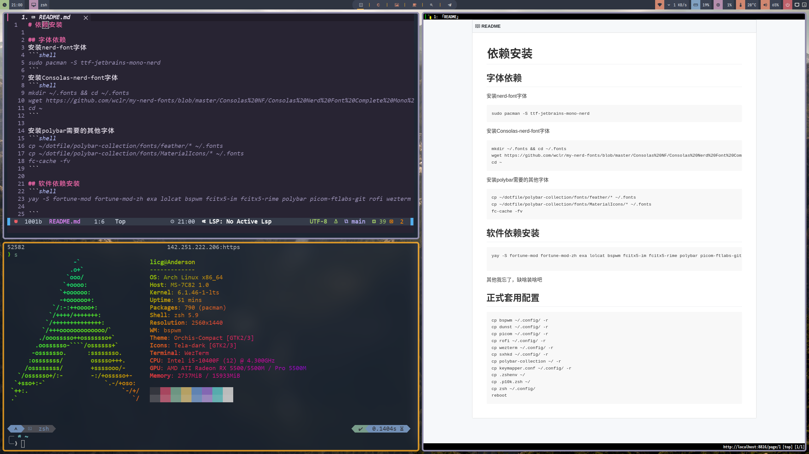

# 依赖安装

## 字体依赖
安装nerd-font字体
```shell
sudo pacman -S ttf-jetbrains-mono-nerd
```
安装Consolas-nerd-font字体
```shell
mkdir ~/.fonts && cd ~/.fonts
wget https://github.com/wclr/my-nerd-fonts/blob/master/Consolas%20NF/Consolas%20Nerd%20Font%20Complete%20Mono%20Windows%20Compatible.ttf
cd ~
```

安装polybar需要的其他字体
```shell
cp ~/dotfile/polybar-collection/fonts/feather/* ~/.fonts
cp ~/dotfile/polybar-collection/fonts/MaterialIcons/* ~/.fonts
fc-cache -fv
```

## 软件依赖安装
```shell
yay -S fortune-mod fortune-mod-zh exa lolcat bspwm fcitx5-im fcitx5-rime polybar picom-ftlabs-git rofi wezterm dunst keymapper sxhkd zsh

```
其他我忘了，缺啥装啥吧
## 正式套用配置
```shell
cp bspwm ~/.config/ -r
cp dunst ~/.config/ -r
cp picom ~/.config/ -r
cp rofi ~/.config/ -r
cp wezterm ~/.config/ -r
cp sxhkd ~/.config/ -r
cp polybar-collection ~/ -r
cp keymapper.conf ~/.config/ -r
cp .zshenv ~/
cp .p10k.zsh ~/
cp zsh ~/.config/
reboot
```
# 结果

